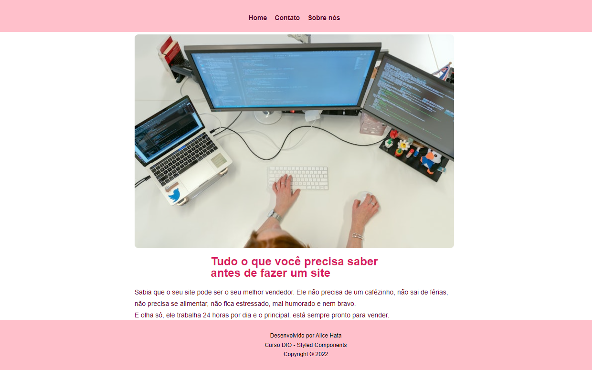

  

# Criando uma home com styled components

Este é um curso ministrada por Raquel Sousa Pereira sobre styled components com react.

## React

É uma biblioteca JavaScript declarativa, eficiente e flexível para criar interfaces. visuais.

## Styled components

Styled-components é uma biblioteca que permite escrever códigos CSS dentro do JavaScript.

## Tarefas

- Criar componentes da página: Header, Content e Footer;
- Estilização básica com styled-components sem Flexbox;
- Adicionar texto padrão Lorem Ipsum ao conteúdo.

## Modificações:

- Estilização com Flexbox;
- Responsividade e media queries;
- Conteúdo modificado com o tema Marketing.

## Créditos

Foto 1 de [ThisIsEngineering](https://www.pexels.com/pt-br/foto/mulher-codificando-no-computador-3861958/)

Foto 2 de [ThisIsEngineering](https://www.pexels.com/pt-br/foto/engenheira-de-software-feminina-codificando-no-computador-3861972/)

Foto 3 de [fauxels](https://www.pexels.com/pt-br/foto/foto-de-pessoas-fazendo-apertos-de-mao-3184301/)
